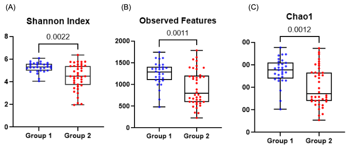

# Alpha Diversity
*Another metric to measure microbiome diversity is alpha diversity, which measures the diversity within samples. For example, alpha diversity can describe the species diversity within a single community or sample. It provides information about how diverse or rich the microbial community is within each sample.*

---

<b>Figure 1:</b> Alpha diversity metrics for group 1 and group 2. Both groups were significantly different in all alpha-diversity variables. (A) The Shannon index reflects the evenness and richness within samples, while (B) Observed Features and (C) Chao1 evaluate the richness within samples. The Shannon index, Observed features, and Chao1 were significantly increased in group 1 compared to group 2, indicating a higher richness and evenness of species within the samples of group 1 (<i>Shannon</i> p=0.0022, <i>Observed features</i> p=0.0011, <i>Chao1</i> p=0.0012). The Mann-Whitney test was used to compare alpha diversity parameters between group 1 and 2.

---

Alpha diversity, or diversity within samples, was significantly different in all alpha-diversity variables between group 1 and group 2 (Figure 1). Three different metrics were used to assess alpha diversity, each providing slightly different information. The Shannon index is an alpha diversity index that reflects both richness and evenness within the samples. Richness is defined as the total number of different species present in a sample (number of different species). A high richness indicates the abundance of many different species within a sample. Evenness describes how evenly distributed the abundance of those species within a sample is (equality of different species abundance). A high evenness reflects that most species are present in an equal abundance. Whereas a low evenness shows that a few species are more abundant than others. The Shannon index was significantly increased in group 1 compared to group 2, indicating an increased richness and evenness in group 1 (Shannon p=0.0022). Observed Features is another metric to evaluate alpha diversity. It refers to the number of different species that are detected and counted within a sample, reflecting species richness. Chao1 is also a metric that evaluates species richness in alpha diversity. In contrast to Observed Features it is a statistical estimator used to estimate the total species richness within a sample. It is particularly useful when low-abundant species are present that might be missed in a typical analysis. Observed Features is a direct count of detected species, while Chao1 attempts to estimate the total richness by accounting for potentially missed rare species. Observed Features and Chao1 were significantly increased in group 1 compared to group 2, indicating an increase in species richness in group 1 (Observed features p=0.0011, Chao1 p=0.0012).

