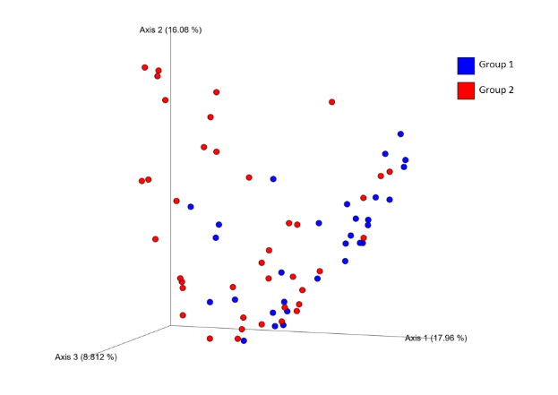
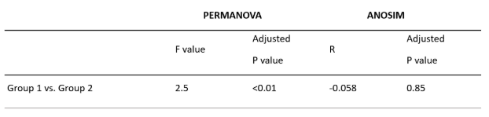

# Beta Diversity
*Beta diversity is a metric used to measure the microbiome diversity between different samples or groups.  It provides information about how similar or different the microbial communities are between the different groups.*

---

Principal coordinate analysis (<i>PCoA</i>) plot based on the Bray-Curtis beta diversity measure, depicting relatedness of microbiome composition between samples. Statistical analysis is shown in Table 1. The <i>PCoA</i> plot reveals some clustering between group 1 and group 2 with substantial overlap, suggesting a shift in composition in a subset of individuals in group 2.

---

Beta diversity revealed minor clustering between groups based on overall microbiota composition. This clustering suggests some shifts in the microbiome based on group classification. Substantial overlap is also observed in the clustering and only a subset of group 2 clusters away from group 1. PERMANOVA analysis revealed significant differences in overall composition (F=2.5, p<0.01) while ANOSIM did not (R=-0.058, 0.85) (Table 1). Overall, the principal coordinate analysis based on the Bray-Curtis dissimilarity measure suggests a shift in the beta diversity of group 1 compared to group 2.

---

<b>Table 1:</b> Statistics for beta diversity based on the Bray-Curtis dissimilarity metric. The <i>PERMANOVA</i> F-value is a measure of difference between groups relative to the in-group variation. An adjusted p-value of &lt;0.01 for the <i>PERMANOVA</i> analysis suggests a statistically significant shift in microbiota composition. In contrast, the <i>ANOSIM</i> (Analysis of Similarities) results indicate an R-value of -0.058 (a measure of group distinction between -1 to 1), with an adjusted p-value of 0.85 suggesting no significant separation between group 1 and group 2.

---