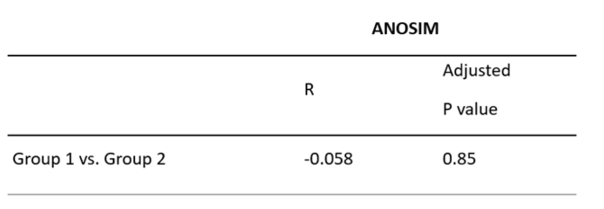

# Beta Diversity
*Beta diversity is a metric used to measure the microbiome diversity between different samples or groups.  It provides information about how similar or different the microbial communities are between the different groups.*

---

Figure 2: Principal coordinate analysis (<i>PCoA</i>) plot based on the Bray-Curtis beta diversity measure, depicting relatedness of microbiome composition between samples. Statistical analysis is shown in Table 1. The <i>PCoA</i> plot reveals some clustering between group 1 and group 2 with substantial overlap, suggesting a shift in composition in a subset of individuals in group 2.

---

Beta diversity, the diversity between samples, revealed minor differences in the microbial composition between group 1 and group 2, demonstrated as two clusters in the Principal coordinate analysis (PCoA) based on Bray-Curtis dissimilarity index (Figure 1). However, a substantial subset of the group 2 samples overlapped with group 1. Statistical analysis ANOSIM showed no significant separation between the two groups (adjusted p-value: 0.85) (Table 1). 

---

Table 1: Statistics for beta diversity based on the Bray-Curtis dissimilarity metric. The ANOSIM (<i>Analysis of Similarities</i>) results indicate an R-value of -0.058 (a measure of group distinction between -1 and 1), with an adjusted p-value of 0.85, suggesting no significant separation between group 1 and group 2.

---