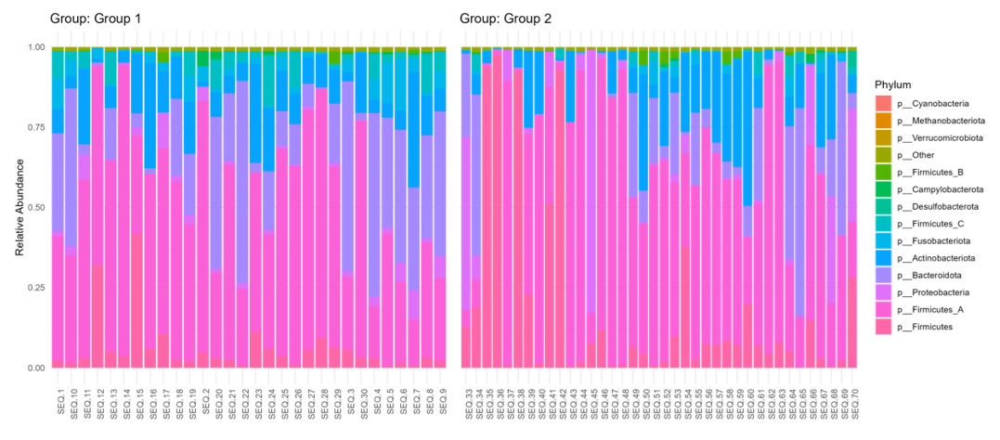
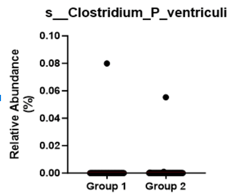
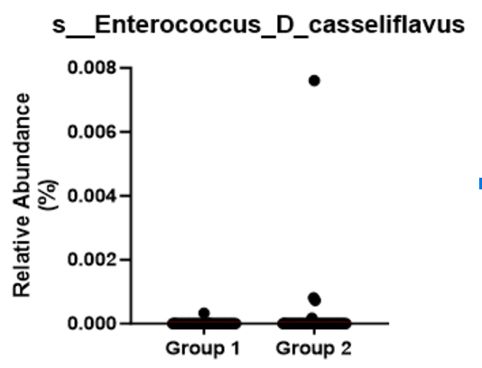
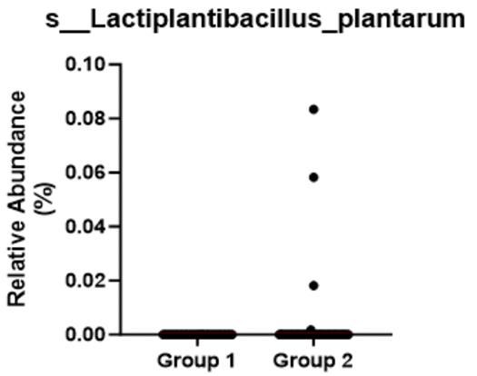
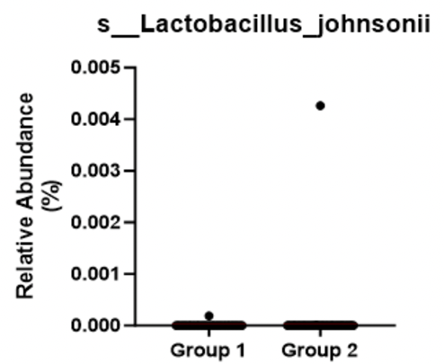
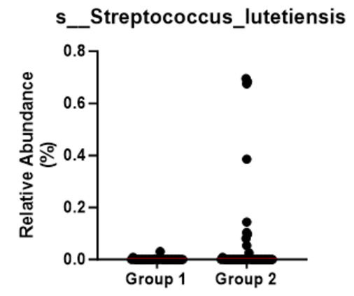

# Taxa Summary

The shotgun metagenomic sequencing showed small changes in fecal bacterial taxa at phylum, family, genus, and species levels between the two groups.

The overall changes in the relative abundance at the phylum level between the groups are graphically shown in the stacked barplot below.

**Figure:** Relative abundance taxonomy bar plot at the phylum level. The plot depicts overall phylum abundance between group 1 and group 2.

## Differential Abundance Analysis
Differentially abundant taxa between the groups at phylum, family, genus, species, and strain levels were identified using Analysis of Composition of Microbiomes with Bias Correction (ANCOM-BC) from the R package ANCOMBC (v 2.2.0) using the default parameters.

Identified significant taxa were visualized using GraphPad Prism v10.0.2 (GraphPad Software, Inc., La Jolla, CA, USA).

### Top Differentially Abundant Taxa

|  |  |  |
|:--------------------------------------------------------------------------------:|:---------------------------------------------------------------------------------------:|:----------------------------------------------------------------------------------------:|
|   |       |                                                                                        |

<b>Figure 4:</b> Differential abundance analysis for group 1 and group 2. The relative abundance of the species (A) <i>Clostridium P ventriculi</i> (p&lt;0.0001), (B) <i>Lactobacillus johnsonii</i> (p&lt;0.0001), (C) <i>Lactiplantibacillus plantarum</i> (p&lt;0.0001), (D) <i>Streptococcus lutetiensis</i> (p&lt;0.0001), and (E) <i>Enterococcus D casseliflavus</i> (p&lt;0.0001) was significantly different between group 1 and group 2. Differentially abundant taxa between the two groups at species levels were identified using Analysis of Composition of Microbiomes with Bias Correction (<i>ANCOM-BC</i>).

